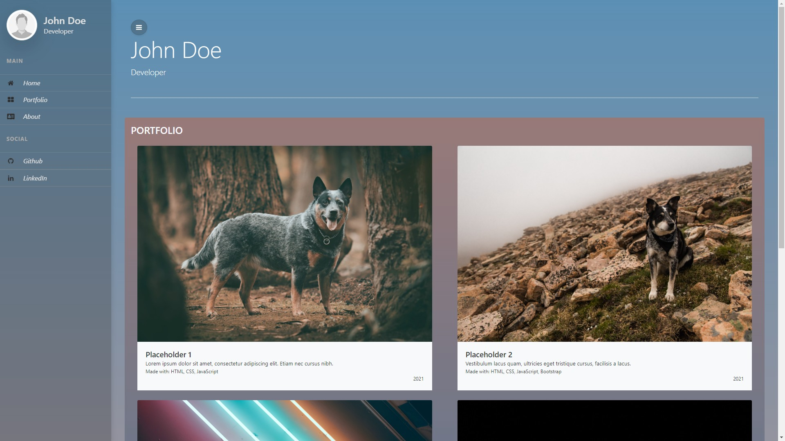

# HTML-Portfolio

This is a simple HTML portfolio template that utilizes HTML, CSS, JavaScript, and Bootstrap 4.

## Description

This portfolio is designed to showcase your projects or works in a clean and visually appealing manner. It uses Bootstrap 4 for styling and responsiveness, along with HTML and CSS for structure and design. JavaScript is incorporated for interactive elements or additional functionalities.

## Features

- Responsive design using Bootstrap 4 grid system
- Easy-to-customize structure with HTML and CSS
- JavaScript for interactive components or dynamic content
- Sample sections for projects, about me, contact information, etc.

